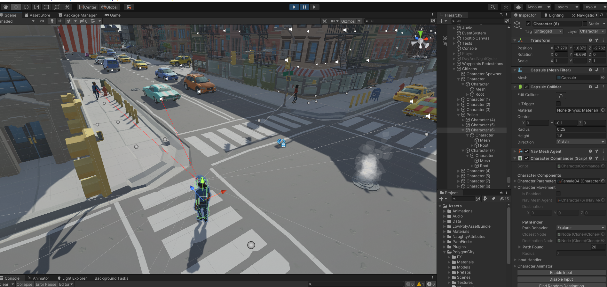

# pathfinder-with-sensors
Implementation of A* Pathfinding with vision sensors in Unity Engine

(I am sharing only the scripts folder because there are some paid assets in the project)

Vision Sensor System

A* Pathfinding

Different "Personalities" can be created using scriptable objects

